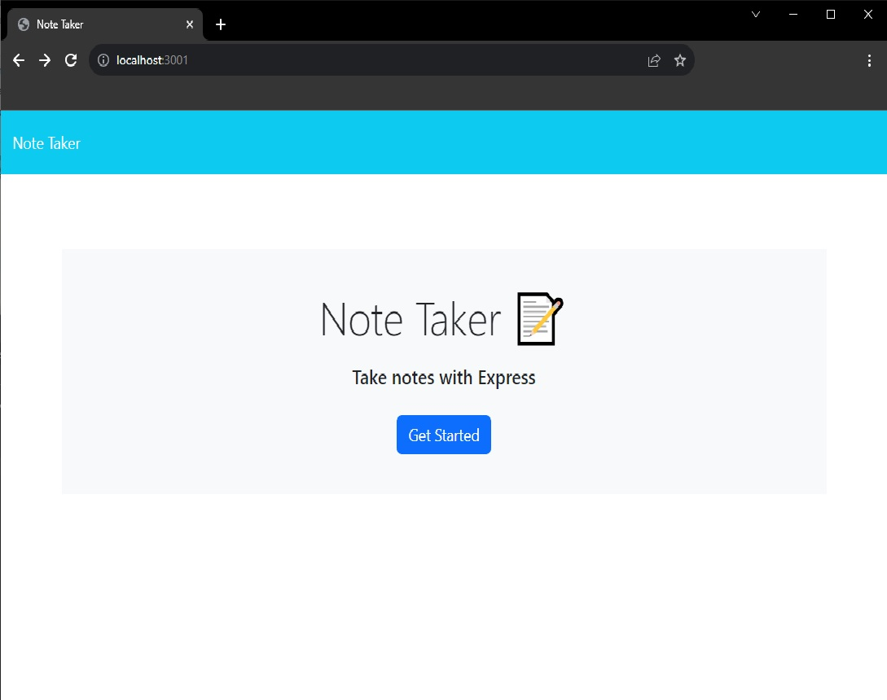
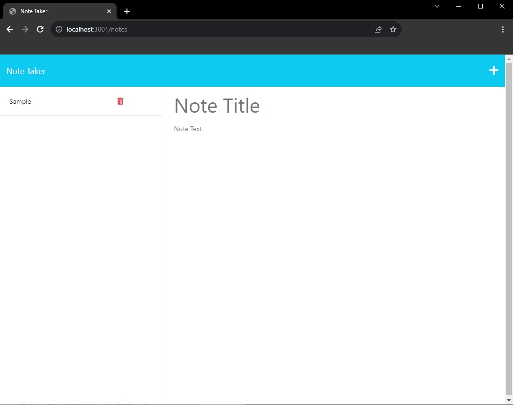

# Note-Taker

Repository URL: https://github.com/Ant-M84/Note-Taker

Application URL via Heroku: https://task-lister-e0e61ecebb91.herokuapp.com/

## Description

This application utilizes Express.js backend framework to enable a user to compose and save notes on in a JSON database file. In addition to Express.js, Uniqid is utilized to give notes a specific id to enable each note to be individually removed from the database note array as required.

## Installation

Clone the repository to the desired location on your system before opening the root directory in the integrated terminal. Install the required packages by running the command 'npm i'.

To run the application locally, start the local server at PORT 3001 by running the command 'node server' and navigating to http://localhost:3001 in your web browser.

## Usage

From the homepage, click on the 'Get Started' Button to navigate to the notes page.

To record a new note, enter a note title and the note text. To save the note - click on the save icon at the top right of the screen.

To delete a note, click on the red trash can icon next to the note you wish to remove.

## Credits

Starter code for project received from UNC Chapel Hill: The Coding Bootcamp includes all front-end related code for the application.
